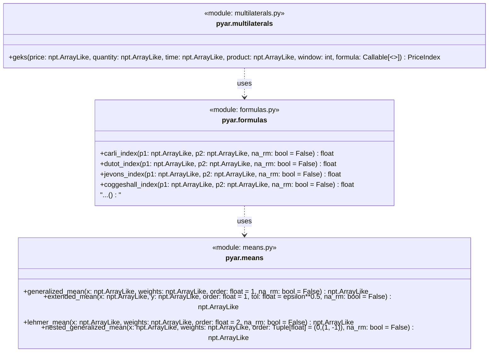
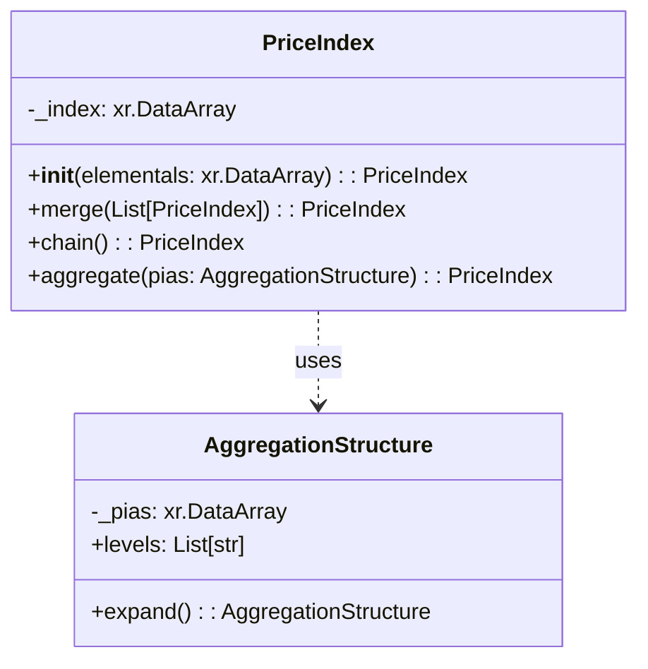

# API Overview

Fundamentally, `pyar` consists of (1) a "toolbox" of price index method implementations that can be used by practitioners and (2) a data model for working with price indexes, product classifications, and price index aggregation structures.

## Price Index Toolbox

## Object Model

